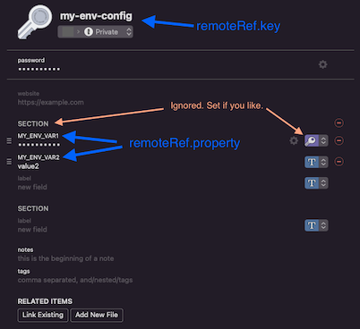
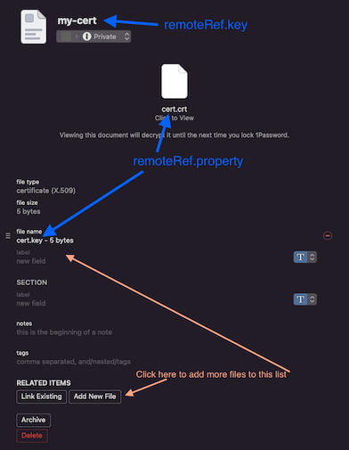
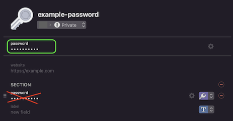

## 1Password Secrets Automation

External Secrets Operator integrates with [1Password Secrets Automation](https://1password.com/products/secrets/) for secret management.

### Important note about this documentation
_**The 1Password API calls the entries in vaults 'Items', so we refer to them here as such.**_

### Behavior
* How an Item is equated to an ExternalSecret:
    * `remoteRef.key` is equated to an Item's Title
    * `remoteRef.property` is equated to:
        * An Item's field's Label (Password type)
        * An Item's file's Name (Document type)
        * If empty, defaults to the first file name, or the field labeled `password`
    * One Item in a vault can equate to one Kubernetes Secret to keep things easy to comprehend.
* Support for 1Password secret types of `Password` and `Document`.
    * The `Password` type can get data from multiple `fields` in the Item.
    * The `Document` type can get data from files.
    * See [creating 1Password Items compatible with ExternalSecrets](#creating-compatible-1password-items).
* Ordered vaults
    * Specify an ordered list of vaults in a SecretStore and the value will be sourced from the first vault with a matching Item.
    * If no matching Item is found, an error is returned.
    * This supports having a default or shared set of values that can also be overriden for specific environments.

### Prerequisites
* 1Password requires running a 1Password Connect Server to which the API requests will be made.
    * External Secrets does not run this server. See [Deploy a Connect Server](#deploy-a-connect-server).
    * One Connect Server is needed per 1Password Automation Environment.
    * Many Vaults can be added to an Automation Environment, and Tokens can be generated in that Environment with access to any set or subset of those Vaults.
* 1Password Connect Server version 1.3.0 or higher. 1.3.0 and 1.5.0 have been tested.

### Setup Authentication
_Auth requires a `1password-credentials.json` provided to the Connect Server, and a related 'Access Token' for the client in this provider to authenticate to that Connect Server. Both of these are generated by 1Password._
1. Setup an Automation Environment [at 1Password.com](https://support.1password.com/secrets-automation/), or [via the op CLI](https://github.com/1Password/connect/blob/a0a5f3d92e68497098d9314721335a7bb68a3b2d/README.md#create-server-and-access-token).
    * Note: don't be confused by the `op connect server create` syntax, you're not creating a server, you're creating credentials for a server, and an Automation Environment.
    * This will result in a `1password-credentials.json` to provide to a Connect Server Deployment, and an Access Token to provide as a Secret referenced by a `SecretStore` or `ClusterSecretStore`.
1. Create a Kubernetes secret with the Access Token
    ```yaml
    
    ```
1. Reference the secret in a SecretStore or ClusterSecretStore
    ```yaml
    
    ```
1. Create a Kubernetes secret with the Connect Server credentials
    ```yaml
    
    ```
1. Reference the secret in a Connect Server Deployment
    ```yaml
    
    ```

### Deploy a Connect Server
* Follow the remaining instructions in the [Quick Start guide](https://github.com/1Password/connect/blob/a0a5f3d92e68497098d9314721335a7bb68a3b2d/README.md#quick-start).
    * Deploy at minimum a Deployment and Service for a Connect Server, to go along with the Secret for the Server created in the [Setup Authentication section](#setup-authentication).
* The Service's name will be referenced in SecretStores/ClusterSecretStores.
* Keep in mind the likely need for additional Connect Servers for other Automation Environments when naming your Services. For example dev, staging, prod, etc.
* Unencrypted secret values are passed over the connection between the operator and the Connect Server. Encrypting the connection is recommended.

### Creating Compatible 1Password Items
_Also see [examples below](#examples) for matching SecretStore and ExternalSecret specs._
#### Manually (Password type)
1. Click the plus button to create a new Password type Item.
1. Change the title to what you want `remoteRef.key` to be.
1. Set what you want `remoteRef.property` to be in the field sections where is says 'label', and values where it says 'new field'.
1. Click the 'Save' button.


#### Manually (Document type)
* Click the plus button to create a new Document type Item.
* Choose the file to upload and upload it.
* Change the title to match `remoteRef.key`
* Click the 'Add New File' button to add more files.
* Click the 'Save' button.


#### Scripting (Password type with op CLI)
_With the `op` [CLI](https://developer.1password.com/docs/cli/v1/get-started/)._
* Create a file `file.json` with the following contents, swapping in your keys and values:
    ```json
    {
      "sections": [
        {
          "fields": [
            {
              "k": "concealed",
              "n": "MY_ENV_VAR1",
              "t": "MY_ENV_VAR1",
              "v": "value1"
            },
            {
              "k": "concealed",
              "n": "MY_ENV_VAR2",
              "t": "MY_ENV_VAR2",
              "v": "value2"
            }
          ],
          "name": "EXTERNAL-SECRETS",
          "title": "EXTERNAL-SECRETS"
        }
      ]
    }
    ```
* Run `op create item password --template file.json --vault my-vault --title my-item`
#### Scripting (Document type)
Unfortunately the `op` CLI doesn't seem to support uploading multiple files to the same Item, and the current Go lib has a [bug](https://github.com/1Password/connect-sdk-go/issues/45). `op` can be used to create a Document type Item with one file in it, but for now it's necessary to add multiple files to the same Document via the GUI.

#### In-built field labeled `password` on Password type Items
* TL;DR if you need a field labeled `password`, use the in-built one rather than the one in a fields section.
    
* 1Password automatically adds a field labeled `password` on every Password type Item, whether it's created through a GUI or the API or `op` CLI.
* There's no problem with using this field just like any other field, _just make sure you don't end up with two fields with the same label_. (For example, by automating the `op` CLI to create Items.)
* The in-built `password` field is not otherwise special for the purposes of ExternalSecrets. It can be ignored when not in use.

### Examples
Examples of using the `my-cert` and `my-env-config` Items [seen above](#manually-password-type).
Note: with this configuration a 1Pasword Item titled `my-cert` is correlated to a ExternalSecret named `my-cert` that results in a Kubernetes secret named `my-cert`, all with matching names for the key/value pairs. This is a way to keep comprehension on the easier side.
```yaml

```
```yaml

```
```yaml

```

### Additional Notes
#### General
* Although it's intuative to use Document type Items for Kubernetes secrets mounted as files, and Password type Items for ones that will be mounted as environment variables, either can be used for either. It comes down to what's more convenient.

#### Why no version history
* 1Password only supports version history on their in-built `password` field. Therefore, implementing version history in this provider would require one Item in 1Password per `remoteRef` in an ExternalSecret. Additionally `remoteRef.property` would be pointless/unusable.
* For example, a Kubernetes secret with 15 keys (say, used in `envFrom`,) would require 15 Items in the 1Password vault, instead of 15 Fields in 1 Item. This would quickly get untenable for more than a few secrets, because:
    * All Items would have to have unique names which means `secretKey` couldn't match the Item name the `remoteRef` is targeting.
    * Maintenance, particularly clean up of no longer used secrets, would be significantly more work.
    * A vault would often become a huge list of unorganized entries as opposed to a much smaller list organized by Kubernetes Secret.
* To support new and old versions of a secret value at the same time, create a new Item in 1Password with the new value, and point some of your ExternalSecret configs at a time to the new Item.

#### Keeping misconfiguration from working
* One instance of the ExternalSecrets operator _can_ work with many Connect Server instances, but it may not be the best approach.
* With one operator instance per Connect Server instance, namespaces and RBAC can be used to improve security posture, and perhaps just as importantly, it's harder to misconfigure something and have it work (supply env A's secret values to env B for example.)
* You can run as many 1Password Connect Servers as you need security boundaries to help protect against accidental misconfiguration.

#### Patching ExternalSecrets with Kustomize
* An overlay can provide a SecretStore specific to that overlay, and then use JSON6902 to patch all the ExternalSecrets coming from base to point to that SecretStore. Here's an example `overlays/staging/kustomization.yaml`:
    ```yaml
    ---
    apiVersion: kustomize.config.k8s.io/v1beta1
    kind: Kustomization

    resources:
    - ../../base/something-with-external-secrets
    - secretStore.staging.yaml

    patchesJson6902:
    - target:
        kind: ExternalSecret
        name: ".*"
      patch: |-
        - op: replace
          path: /spec/secretStoreRef/name
          value: staging
    ```
